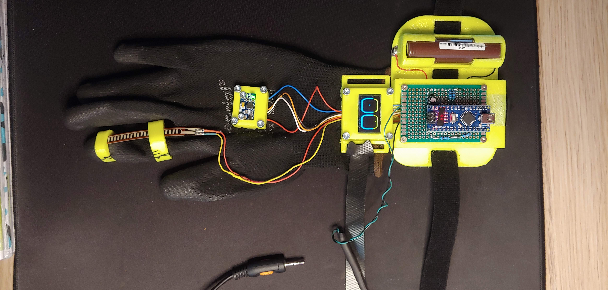
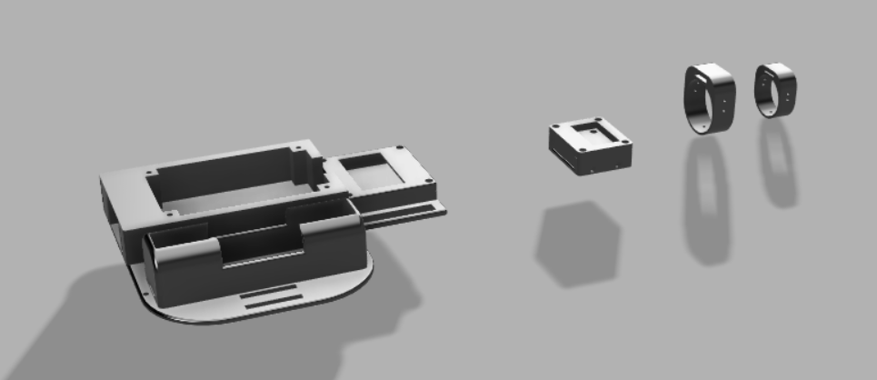
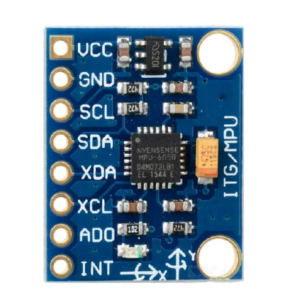
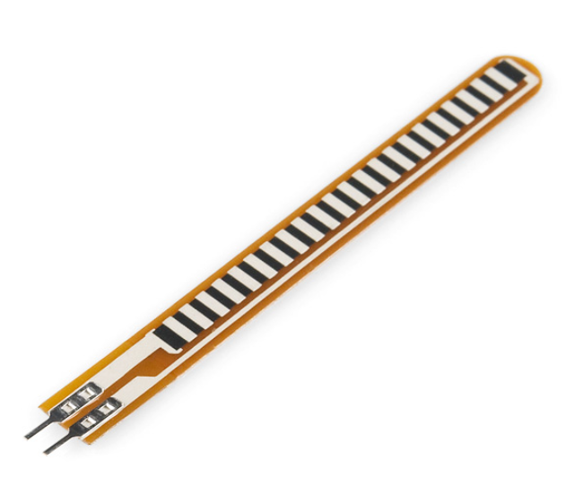
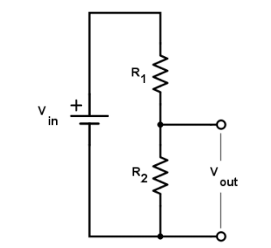
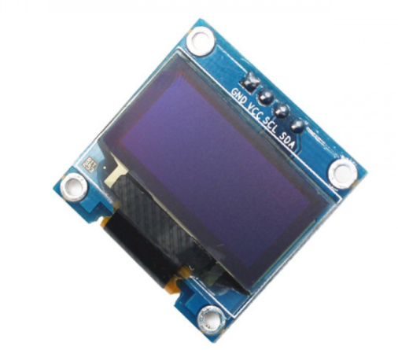
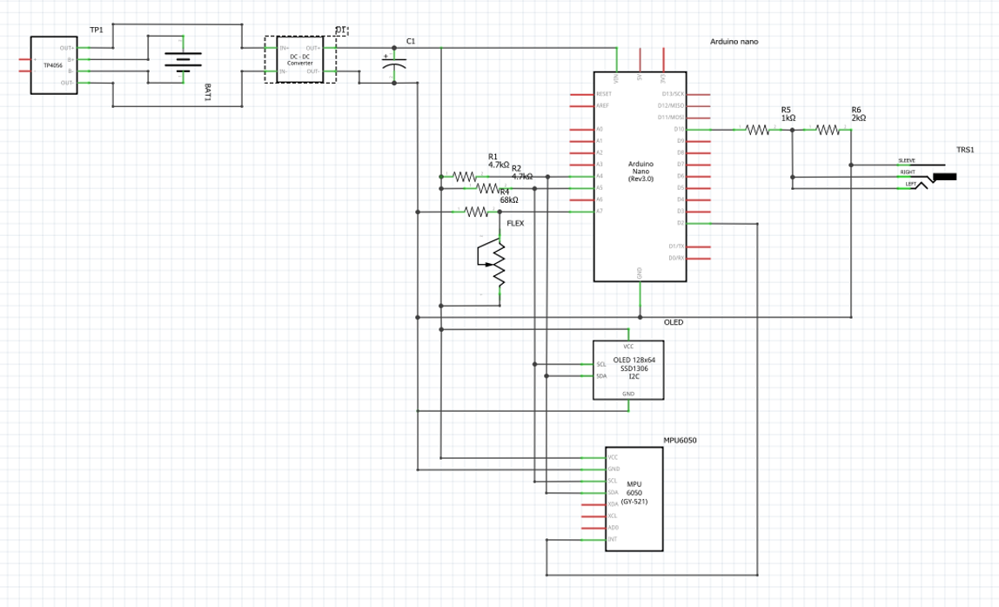

# Končni projekt pri predmetu VIN 2020/21

Avtor: Nik Prinčič

Mentor: viš. pred. dr. Robert Rozman

## Ideja delovanja

Nadziranje FPV drona z nagibanjem roke (roll, pitch, yaw) ter stiskanjem pesti (throttle). Za zaznavanje nagiba roke sem uporabil MPU6050 (6 DoF IMU), ki ima vgrajen DMP (digital motion processing) enoto, ki prepreči, da bi vrednosti, ki ju izmerita pospeškomer in žiroskop skozi čas začele odstopati zaradi pojava imenovanega "sensor drift". Za nadzor plina (throttle) pa sem uporabil flex senzor v kombinaciji z delilnikom napetosti. Flex senzor v delilniku napetosti opravlja nalogo variabilnega upora R1 (razpon upornosti od 30K do 110K), za upor R2 pa sem izbral upornost 68K. Za vizualizacijo pozicije vsakega od 4 kanalov (stick position) pa sem uporabil OLED zaslon. Vse skupaj pa nadzira Arduino Nano, ki tudi generira CPPM signal ki ga potem preko 3,5mm konektorja pošilja v oddajnik, ki komunicira z dronom.

Da bi vse navedene komponete lahko montiral na roko sem s pomočjo programa za 3D modeliranje in 3D tiskalnika izdelal nekaj nosilcev. Vsi nosilci so izdelani z delno fleksibilnega materiala TPU, da sel lažje prilagodijo obl. Za napajanje pa sem uporabil 18650 Li-Ion celico, ki je preko BMS modula povezana na DC-DC boost module, ki napetost dvigne na 5V.

<p align="center">
 
  
</p>

## Razvojno okolje

Za razvojno okolje sem si izbral [Platform IO](https://platformio.org/), ki deluje kot vtičnik (plugin) za Microsoft VS Code in ponuja precej več funkcionalnosti od klasičnega Arduino IDE okolja.

<p align="center">
 
</p>

## Delovanje MPU6050

MPU6050 uporabljam v načinu, ki izkorišča DMP enoto, zato je poleg I2C povezave potrebna še povezava na prekinitveno nožico Arduina. Ko DMP enota sprocesira pordatke sproži prekinitev, ki Arduino opozori da so podatki pripravljeni za branje. Za interkcijo z MPU6050 sem uporabil knjižnico [Simple_MPU6050](https://github.com/ZHomeSlice/Simple_MPU6050), ki v DMP enoto naloži potrben program (Invensense Embedded MotionDriver 6.12) in olajša vso ostalo konfiguracijo in komunikacijo.

<p align="center">
 
</p>

## Delovanje Flex senzorja

Flex senzor je preko delilnika napetosti povezan na analogno nožico Arduina. Flex senzor v delilniku napetosti opravlja vlogo variabilnega upora R1, vrednost fiksnega upora R2 pa sem izbral tako, da delilnik napetosti proizvede največjo, še berljivo, razliko v napetosti glede na stanje variabilnega upora R1. Prebrana vrednost se preko ADC pretvornika pretvori v diskretno vrednost, ki se potem z pomočjo funkcije map(), preslika na interval med 1000 in 2000 (min. in max. vrednost servo kanalov). Za kalibracijo senzorja sem najprej moral poiskati max. in min. vrednost, ki jih senzor lahko prebere ko je fiksiran na rokavici.

<p align="center">
 
 
</p>

## Delovanje OLED zaslona (SSD1306)

Zalon je na Arduino povezan preko istega I2C vodila kot MPU6050. Na zaslonu so prikazane vrednosti vseh štirih kanalov v obliki "stick position". Za upravljanje zaslona sem uporabil knjižnici Adafruit SSD1306 in Adafruit GFX Library.

<p align="center">
 
</p>

## Generiranje PPM/CPPM signala

(Combined) Pulse Position Modulation je vrsta signala, ki se uporablja v večini RC modelov, dronov, letal,... . Poznamo več različni standardov CPPM signalov, pri tem projektu sem uporabil različico, ki podpira do 12 ločenih kanalov, dolžina okvirja je 22,5 ms, dolžina pulza (high state) pa je 0,3 ms, dolžina nizkega stanja (low state) pa je vbrednost_kanala - 0.3ms. Vrednosti kanalov pa so od 1000 do 2000.
Za generiranje signala sem uporabil časovnik, ki šteje z frekvenco 2 MHz (1/(2\*10^6) = 0.5 μs). Časovnik se tudi postavi v CTC način delovanja, ter nastavi se tudi prekinitveni vektor.

Psevdokoda funkcije, ki se izvede ob prekinitvi, ki jo sproži časovnik:

```
state = true
cur_chan_numb = 0
calc_rest = 0
CPPM_MODULATION = HIGH
PULSE_LENGTH = 300
FRAME_LENGTH = 22500
CHANNEL_NUMBER = 12
ppm [CHANNEL_NUMBER]

fun tim_interupt():
    TCNT1 = 0
    if state:
        digital_write(OUT_PIN, HIGH)
        OCR1A = PULSE_LENGTH * 2
        state = false
    else:
        digital_write(OUT_PIN, !CPPM_MODULATION)
        state = true
        if cur_chan_numb >= CHANNEL_NUMBER:
            cur_chan_numb = 0
            calc_rest = calc_rest + PULSE_LENGTH
            OCR1A = (FRAME_LENGTH - calc_rest) * 2
            calc_rest = 0
        else:
            OCR1A = (ppm[cur_chan_numb] - PULSE_LENGTH) * 2
            calc_rest = calc_rest + ppm[cur_chan_numb]
            cur_chan_numb = cur_chan_numb + 1
```

## Vezalna shema

<p align="center">
 
</p>

## Problemi na katere sem naletel

-   Pomankanje flash pomnilnika, zato sem iz knjižnic odstranil večino neuporabljenih funkcijonalnosti.
-   Nezanesljiav I2C komunikacija v končnem vezju. I2C komunikacija je na breadboardu delovala normalno smao z built-in pull up upori, ki jih ima Arduino Nano, v končnem vezju pa je prihajalo do napak, zato sem na SDA in SLC linije dodal dodatna 4.7K pull up upora, ki sta rešila problem.

## Zaključek

idejo za projekt sem imel že nekaj časa, a si nikoli nisem vezl časa, da bi ga realiziral, zato sem izkoristil priložnost in ga realiziral v sklopu predmeta VIN. Med izdelavo sem se naučil kar nekaj novih stvari, na katere med samim načrtovanjem nisem niti preveč pomislil. Končni izdelek je dejansko lahko uporaben za pilotiranje FPV drona, a je sprva občutek zelo čuden, s časom pa pa postane malo bolj podoben občutku pilotiranja z klasičnima joystickoma.

Posnetek delovanja: https://www.youtube.com/watch?v=oFNRZHOGsho
